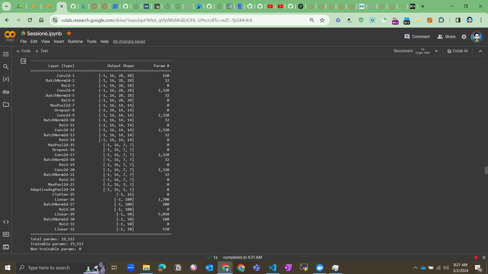
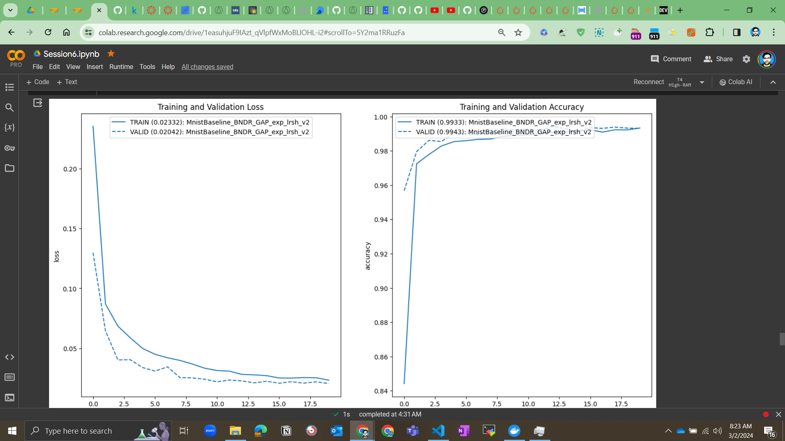

# Assignment 6 - I

## Hands-on Backpropagation calculation in excel sheet

- Create a simple neural network with 2 input neurons, 2 hidden neurons 1 layer, and 2 output neurons.
- Use the sigmoid activation function for the hidden layer and the output layer.
- Use the squared error loss function.
- Use the backpropagation algorithm to calculate the weight updates for the hidden layer and the output layer.
- Calculation can be divided into 6 parts:
    - Forward pass: Calculating the forward pass which involves 2 hiiden unit in First hidden layer and application of sigmoid function
    - BackPropagation-1 : Calculating loss gradient wrt weight 5 and comprehensive analysis
    - Backpropagation-2 : Calculating loss gradient wrt weight 5 ,6,7,8 which connects first hidden layer and output layer
    - Backpropagation-3 : Calculating gradient of the loss wrt to hiddent units in first hidden layer
    - Backpropagation-4 : Next layer deals with calculating gradient of loss wrt to initial weights which connects input layer to first hidden layer

## Loss curve analysis for different learning rates

### LR = 0.1 

### LR = 0.2

### LR = 0.5

### LR = 0.8

### LR = 1.0

### LR = 2.0

# Assignment 6 - II

## Redo the coding assignment with the following changes:

- 99.4% validation accuracy
- Less than 20k Parameters
- You can use anything from above you want. 
- Less than 20 Epochs
- Have used BN, Dropout
- (Optional): a Fully connected layer, have used GAP

## Solution

- The solution is implemented in the file [session6.ipynb](session6.ipynb)
- The solution is trained for 20 epochs and the model is able to achieve 99.4% validation accuracy
- The best model that has worker the best so far and has touched the mark of 99.4 is MnistBaseline_BNDR_GAP with ExponentialLR with gamma value of 0.8 with standard    weight init
- The best model has 19,512 learning parameters
- Below are a few Basic things that we tried from  Model Building perspective :
    1. Baseline model with only 2 layers of convolution block and one layer of 3 fc making sure total params are within 20k
    2. Next we will try adding Batch norm and Dropout at right positions
    3. Application of Gloabl Average Pooling layer on top of the Fc block
    4. Next we will try using adaptive learning rate like exp lr and cyclic lr
    5. Next we will try improving the model with  ReduceLROnPlateau
    6. If required we will also try better initailization of weights

## Model Performance Analysis

### Model Architecture

### Model Training and Validation Accuracy

