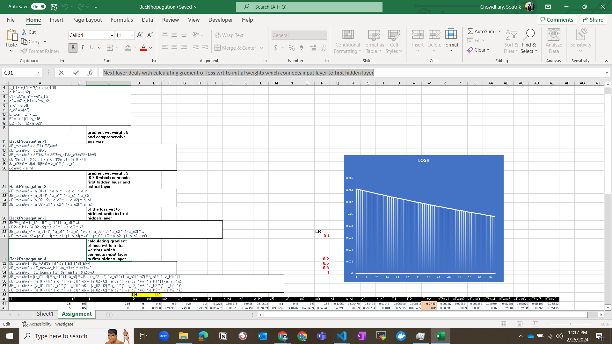
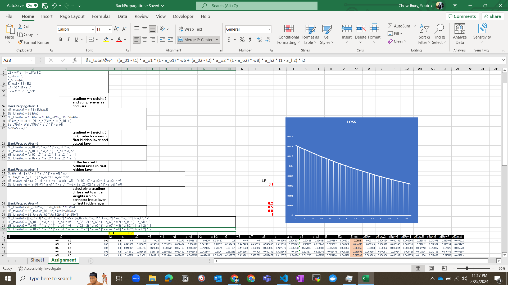
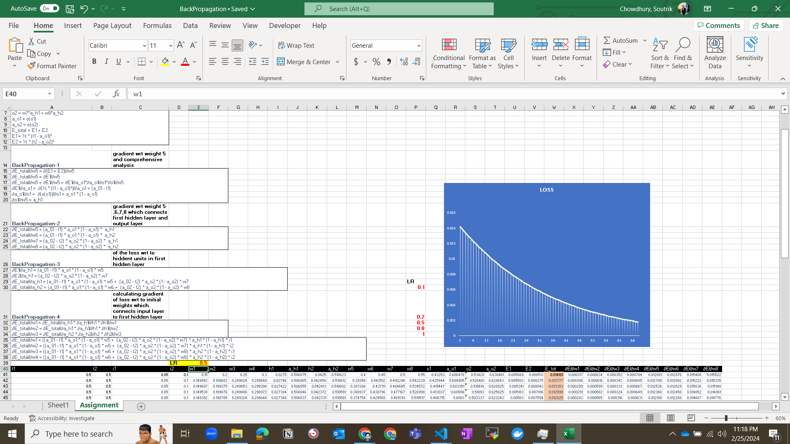
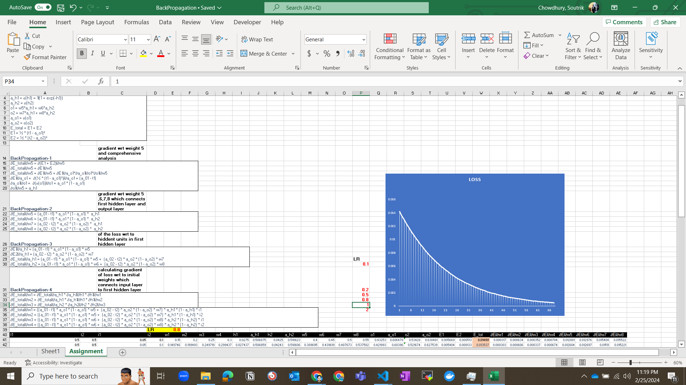

## Hands-on Backpropagation calculation in excel sheet

- Create a simple neural network with 2 input neurons, 2 hidden neurons 1 layer, and 2 output neurons.
- Use the sigmoid activation function for the hidden layer and the output layer.
- Use the squared error loss function.
- Use the backpropagation algorithm to calculate the weight updates for the hidden layer and the output layer.
- Calculation can be divided into 6 parts:
    - Forward pass: Calculating the forward pass which involves 2 hiiden unit in First hidden layer and application of sigmoid function
    - BackPropagation-1 : Calculating loss gradient wrt weight 5 and comprehensive analysis
    - Backpropagation-2 : Calculating loss gradient wrt weight 5 ,6,7,8 which connects first hidden layer and output layer
    - Backpropagation-3 : Calculating gradient of the loss wrt to hiddent units in first hidden layer
    - Backpropagation-4 : Next layer deals with calculating gradient of loss wrt to initial weights which connects input layer to first hidden layer

## Loss curve analysis for different learning rates

### LR = 0.1 

### LR = 0.2

### LR = 0.5

### LR = 0.8

### LR = 1.0

### LR = 2.0

