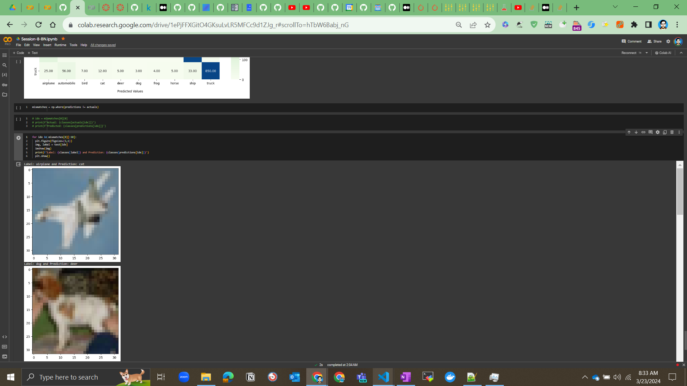
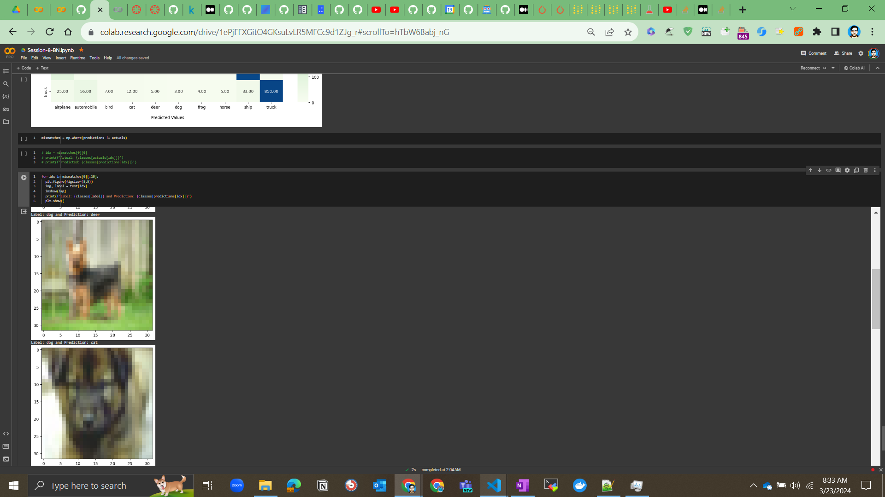
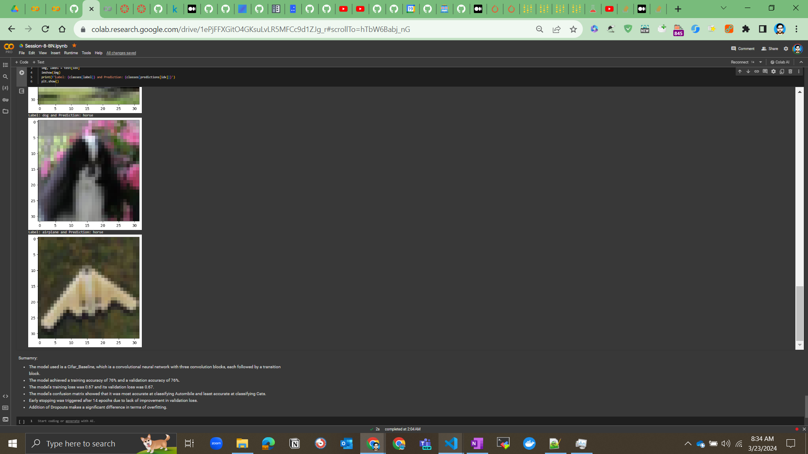
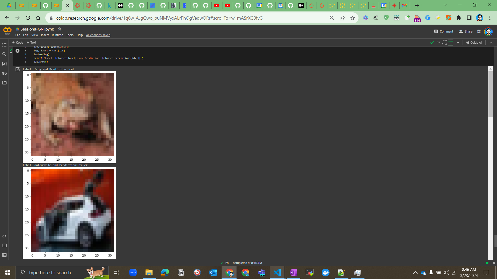
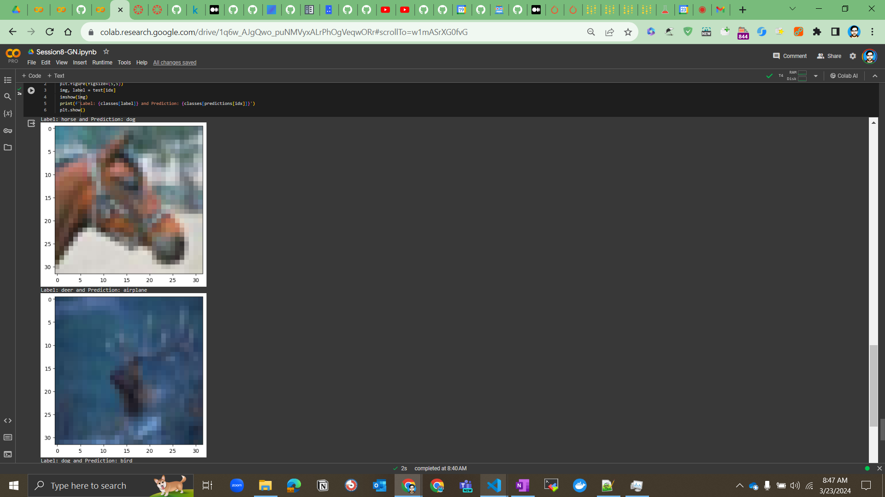
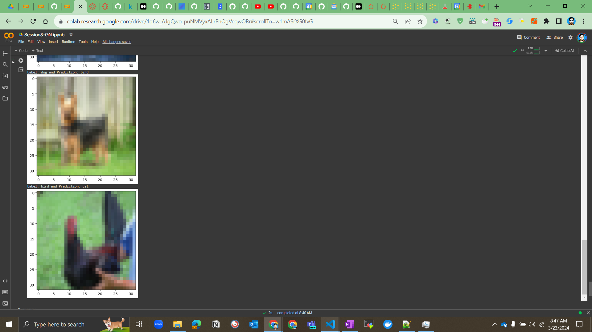

## Batch Normalization

### Target:

* Make this network: C1 C2 c3 P1 C4 C5 C6 c7 P2 C8 C9 C10 GAP c11 cN is 1x1 Layer
* Keep the parameter count less than 50000
* Max Epochs is 20
* Use Batch Normalization

### Results:

- The model used is a Cifar_Baseline, which is a convolutional neural network with three convolution blocks, each followed by a transition block.
- The model achieved a training accuracy of 76% and a validation accuracy of 76%.
- The model's training loss was 0.67 and its validation loss was 0.67.
- The model's confusion matrix showed that it was most accurate at classifying Autombile and least accurate at classifying Cats.
- Early stopping was triggered after 14 epochs due to lack of improvement in validation loss.
- Addition of Dropouts makes a significant difference in terms of overfitting.

### References:

Misclassified Images->

## Group Normalization

### Target:

* Make this network: C1 C2 c3 P1 C4 C5 C6 c7 P2 C8 C9 C10 GAP c11 cN is 1x1 Layer
* Keep the parameter count less than 50000
* Max Epochs is 20
* Use of Group Normalization with DP

### Results:

- The model used is a Cifar_Baseline, which is a convolutional neural network with three convolution blocks, each followed by a transition block.
- The model achieved a training accuracy of 70% and a validation accuracy of 70%.
- The model's training loss was 0.84 and its validation loss was 0.83.
- The model's confusion matrix showed that it was most accurate at classifying Autombile and least accurate at classifying Cats.
- Early stopping was triggered after N epochs due to lack of improvement in validation loss.
- Addition of Dropouts makes a significant difference in terms of overfitting.

### References:

Misclassified Images->

## Layer Normalization

WIP

## Links:
https://medium.com/@zljdanceholic/groupnorm-then-batchnorm-instancenorm-layernorm-e2b2a1d350a0
https://wandb.ai/wandb_fc/Normalization/reports/Normalization-Series-What-is-Batch-Norm---VmlldzoxMjk2ODcz
https://wandb.ai/wandb_fc/GroupNorm/reports/Group-Normalization-in-Pytorch-With-Examples---VmlldzoxMzU0MzMy
https://wandb.ai/wandb_fc/LayerNorm/reports/Layer-Normalization-in-Pytorch-With-Examples---VmlldzoxMjk5MTk1
https://wandb.ai/wandb_fc/Normalization-Series/reports/Instance-Normalization-in-PyTorch-With-Examples---VmlldzoxNDIyNTQx
