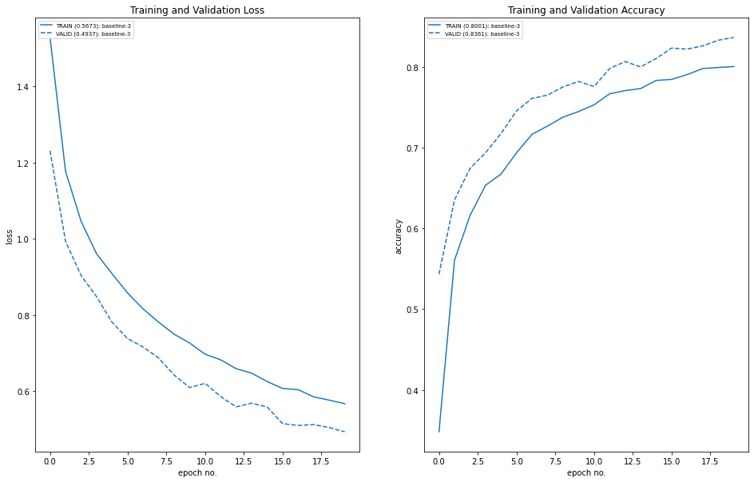
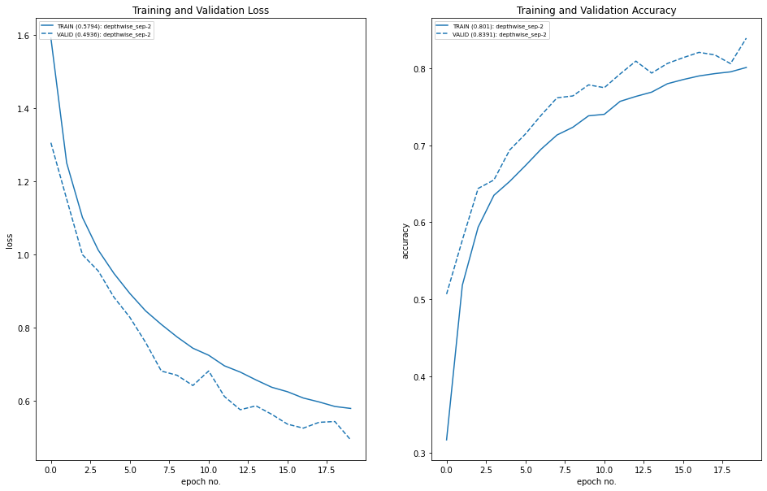
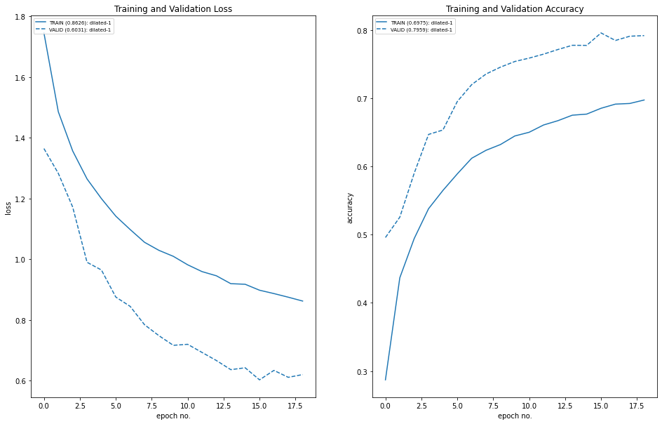
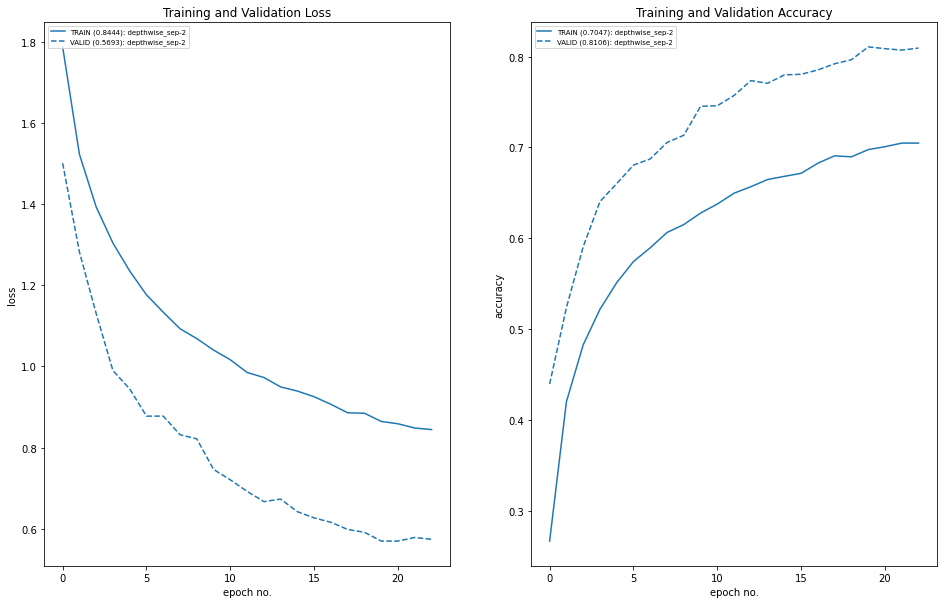

## Overrall Process:

* The architecture to C1C2C3C40 (No MaxPooling, but 3 convolutions, where the last one has a stride of 2 instead) (If you can figure out how to use Dilated kernels here instead of MP or strided convolution, then 200pts extra!)
* total RF must be more than 44
* one of the layers must use Depthwise Separable Convolution
* one of the layers must use Dilated Convolution
* use GAP (compulsory):- add FC after GAP to target #of classes (optional)
* use albumentation library and apply:
* horizontal flip
* shiftScaleRotate
* coarseDropout (max_holes = 1, max_height=16px, max_width=16, min_holes = 1, min_height=16px, min_width=16px, fill_value=(mean of your dataset), mask_fill_value = None)
* Training done under 30 epochs with early stopping with a patience of 3

## Application of torch vision.transform module:

### transformation applied
```python
# Train Phase transformations
train_transforms = transforms.Compose(
    [
        transforms.RandomCrop(32, padding=4, padding_mode="reflect"),
        transforms.RandomHorizontalFlip(),
        transforms.RandomRotation(15),
        transforms.ToTensor(),
        transforms.Normalize(
            (0.4914, 0.4822, 0.4465), (0.2023, 0.1994, 0.2010)
        ),  # The mean and std have to be sequences (e.g., tuples), therefore you should add a comma after the values.
    ]
)

# Test Phase transformations
test_transforms = transforms.Compose(
    [
        transforms.ToTensor(),
        transforms.Normalize((0.4914, 0.4822, 0.4465), (0.2023, 0.1994, 0.2010)),
    ]
)
```

### Only Dilated Model

#### Summary

```python
----------------------------------------------------------------
        Layer (type)               Output Shape         Param #
================================================================
            Conv2d-1           [-1, 32, 32, 32]             864
       BatchNorm2d-2           [-1, 32, 32, 32]              64
              ReLU-3           [-1, 32, 32, 32]               0
           Dropout-4           [-1, 32, 32, 32]               0
            Conv2d-5           [-1, 64, 32, 32]          18,432
              ReLU-6           [-1, 64, 32, 32]               0
       BatchNorm2d-7           [-1, 64, 32, 32]             128
           Dropout-8           [-1, 64, 32, 32]               0
            Conv2d-9           [-1, 64, 30, 30]          36,864
             ReLU-10           [-1, 64, 30, 30]               0
      BatchNorm2d-11           [-1, 64, 30, 30]             128
          Dropout-12           [-1, 64, 30, 30]               0
           Conv2d-13           [-1, 16, 30, 30]           1,024
           Conv2d-14           [-1, 32, 30, 30]           4,608
      BatchNorm2d-15           [-1, 32, 30, 30]              64
             ReLU-16           [-1, 32, 30, 30]               0
          Dropout-17           [-1, 32, 30, 30]               0
           Conv2d-18           [-1, 64, 30, 30]          18,432
             ReLU-19           [-1, 64, 30, 30]               0
      BatchNorm2d-20           [-1, 64, 30, 30]             128
          Dropout-21           [-1, 64, 30, 30]               0
           Conv2d-22           [-1, 64, 28, 28]          36,864
             ReLU-23           [-1, 64, 28, 28]               0
      BatchNorm2d-24           [-1, 64, 28, 28]             128
          Dropout-25           [-1, 64, 28, 28]               0
           Conv2d-26           [-1, 16, 28, 28]           1,024
           Conv2d-27           [-1, 32, 28, 28]           4,608
      BatchNorm2d-28           [-1, 32, 28, 28]              64
             ReLU-29           [-1, 32, 28, 28]               0
          Dropout-30           [-1, 32, 28, 28]               0
           Conv2d-31           [-1, 64, 28, 28]          18,432
             ReLU-32           [-1, 64, 28, 28]               0
      BatchNorm2d-33           [-1, 64, 28, 28]             128
          Dropout-34           [-1, 64, 28, 28]               0
           Conv2d-35           [-1, 64, 26, 26]          36,864
             ReLU-36           [-1, 64, 26, 26]               0
      BatchNorm2d-37           [-1, 64, 26, 26]             128
          Dropout-38           [-1, 64, 26, 26]               0
           Conv2d-39           [-1, 16, 26, 26]           1,024
           Conv2d-40           [-1, 32, 26, 26]           4,608
      BatchNorm2d-41           [-1, 32, 26, 26]              64
             ReLU-42           [-1, 32, 26, 26]               0
          Dropout-43           [-1, 32, 26, 26]               0
           Conv2d-44           [-1, 64, 26, 26]          18,432
             ReLU-45           [-1, 64, 26, 26]               0
      BatchNorm2d-46           [-1, 64, 26, 26]             128
          Dropout-47           [-1, 64, 26, 26]               0
AdaptiveAvgPool2d-48             [-1, 64, 1, 1]               0
           Conv2d-49             [-1, 10, 1, 1]             640
================================================================
Total params: 203,872
Trainable params: 203,872
Non-trainable params: 0
----------------------------------------------------------------
Input size (MB): 0.01
Forward/backward pass size (MB): 14.81
Params size (MB): 0.78
Estimated Total Size (MB): 15.60
----------------------------------------------------------------
```
#### Model Performances



### Depthwise Separable Convolution Model

#### Summary

```python
----------------------------------------------------------------
        Layer (type)               Output Shape         Param #
================================================================
            Conv2d-1           [-1, 32, 32, 32]             864
       BatchNorm2d-2           [-1, 32, 32, 32]              64
              ReLU-3           [-1, 32, 32, 32]               0
           Dropout-4           [-1, 32, 32, 32]               0
            Conv2d-5           [-1, 64, 32, 32]          18,432
              ReLU-6           [-1, 64, 32, 32]               0
       BatchNorm2d-7           [-1, 64, 32, 32]             128
           Dropout-8           [-1, 64, 32, 32]               0
            Conv2d-9           [-1, 64, 30, 30]          36,864
             ReLU-10           [-1, 64, 30, 30]               0
      BatchNorm2d-11           [-1, 64, 30, 30]             128
          Dropout-12           [-1, 64, 30, 30]               0
           Conv2d-13           [-1, 16, 30, 30]           1,024
           Conv2d-14           [-1, 32, 30, 30]           4,608
      BatchNorm2d-15           [-1, 32, 30, 30]              64
             ReLU-16           [-1, 32, 30, 30]               0
          Dropout-17           [-1, 32, 30, 30]               0
           Conv2d-18           [-1, 64, 30, 30]          18,432
             ReLU-19           [-1, 64, 30, 30]               0
      BatchNorm2d-20           [-1, 64, 30, 30]             128
          Dropout-21           [-1, 64, 30, 30]               0
           Conv2d-22           [-1, 64, 28, 28]          36,864
             ReLU-23           [-1, 64, 28, 28]               0
      BatchNorm2d-24           [-1, 64, 28, 28]             128
          Dropout-25           [-1, 64, 28, 28]               0
           Conv2d-26           [-1, 16, 28, 28]           1,024
           Conv2d-27           [-1, 32, 28, 28]           4,608
      BatchNorm2d-28           [-1, 32, 28, 28]              64
             ReLU-29           [-1, 32, 28, 28]               0
          Dropout-30           [-1, 32, 28, 28]               0
           Conv2d-31           [-1, 64, 28, 28]          18,432
             ReLU-32           [-1, 64, 28, 28]               0
      BatchNorm2d-33           [-1, 64, 28, 28]             128
          Dropout-34           [-1, 64, 28, 28]               0
           Conv2d-35           [-1, 64, 26, 26]          36,864
             ReLU-36           [-1, 64, 26, 26]               0
      BatchNorm2d-37           [-1, 64, 26, 26]             128
          Dropout-38           [-1, 64, 26, 26]               0
           Conv2d-39           [-1, 16, 26, 26]           1,024
           Conv2d-40           [-1, 32, 26, 26]             288
           Conv2d-41           [-1, 32, 26, 26]           1,024
      BatchNorm2d-42           [-1, 32, 26, 26]              64
             ReLU-43           [-1, 32, 26, 26]               0
          Dropout-44           [-1, 32, 26, 26]               0
           Conv2d-45           [-1, 64, 26, 26]             576
           Conv2d-46           [-1, 64, 26, 26]           4,096
      BatchNorm2d-47           [-1, 64, 26, 26]             128
             ReLU-48           [-1, 64, 26, 26]               0
          Dropout-49           [-1, 64, 26, 26]               0
           Conv2d-50           [-1, 64, 26, 26]             576
           Conv2d-51           [-1, 64, 26, 26]           4,096
      BatchNorm2d-52           [-1, 64, 26, 26]             128
             ReLU-53           [-1, 64, 26, 26]               0
          Dropout-54           [-1, 64, 26, 26]               0
           Conv2d-55          [-1, 128, 26, 26]           1,152
           Conv2d-56          [-1, 128, 26, 26]          16,384
      BatchNorm2d-57          [-1, 128, 26, 26]             256
             ReLU-58          [-1, 128, 26, 26]               0
AdaptiveAvgPool2d-59            [-1, 128, 1, 1]               0
           Conv2d-60             [-1, 10, 1, 1]           1,280
================================================================
Total params: 210,048
Trainable params: 210,048
Non-trainable params: 0
----------------------------------------------------------------
Input size (MB): 0.01
Forward/backward pass size (MB): 19.60
Params size (MB): 0.80
Estimated Total Size (MB): 20.41
----------------------------------------------------------------
```

#### Model Performances




## Application of Albumentation library

### transformation applied
```python
train_transforms = alb.Compose(
    [
        alb.HorizontalFlip(),
        alb.ShiftScaleRotate(),
        alb.ColorJitter(),
        alb.CoarseDropout(
            max_holes=1,
            max_height=16,
            max_width=16,
            min_holes=1,
            min_height=16,
            min_width=16,
            fill_value=[0.4914, 0.4822, 0.4465],
            mask_fill_value=None,
        ),
        alb.Normalize(mean=(0.4914, 0.4822, 0.4465), std=(0.2023, 0.1994, 0.2010)),
        ToTensorV2(),
    ]
)

test_transforms = alb.Compose(
    [
        alb.Normalize(mean=(0.4914, 0.4822, 0.4465), std=(0.2023, 0.1994, 0.2010)),
        ToTensorV2(),
    ]
)
```

### Only Dilated Model

#### Summary

```python
----------------------------------------------------------------
        Layer (type)               Output Shape         Param #
================================================================
            Conv2d-1           [-1, 32, 32, 32]             864
       BatchNorm2d-2           [-1, 32, 32, 32]              64
              ReLU-3           [-1, 32, 32, 32]               0
           Dropout-4           [-1, 32, 32, 32]               0
            Conv2d-5           [-1, 64, 32, 32]          18,432
              ReLU-6           [-1, 64, 32, 32]               0
       BatchNorm2d-7           [-1, 64, 32, 32]             128
           Dropout-8           [-1, 64, 32, 32]               0
            Conv2d-9           [-1, 64, 30, 30]          36,864
             ReLU-10           [-1, 64, 30, 30]               0
      BatchNorm2d-11           [-1, 64, 30, 30]             128
          Dropout-12           [-1, 64, 30, 30]               0
           Conv2d-13           [-1, 16, 30, 30]           1,024
           Conv2d-14           [-1, 32, 30, 30]           4,608
      BatchNorm2d-15           [-1, 32, 30, 30]              64
             ReLU-16           [-1, 32, 30, 30]               0
          Dropout-17           [-1, 32, 30, 30]               0
           Conv2d-18           [-1, 64, 30, 30]          18,432
             ReLU-19           [-1, 64, 30, 30]               0
      BatchNorm2d-20           [-1, 64, 30, 30]             128
          Dropout-21           [-1, 64, 30, 30]               0
           Conv2d-22           [-1, 64, 28, 28]          36,864
             ReLU-23           [-1, 64, 28, 28]               0
      BatchNorm2d-24           [-1, 64, 28, 28]             128
          Dropout-25           [-1, 64, 28, 28]               0
           Conv2d-26           [-1, 16, 28, 28]           1,024
           Conv2d-27           [-1, 32, 28, 28]           4,608
      BatchNorm2d-28           [-1, 32, 28, 28]              64
             ReLU-29           [-1, 32, 28, 28]               0
          Dropout-30           [-1, 32, 28, 28]               0
           Conv2d-31           [-1, 64, 28, 28]          18,432
             ReLU-32           [-1, 64, 28, 28]               0
      BatchNorm2d-33           [-1, 64, 28, 28]             128
          Dropout-34           [-1, 64, 28, 28]               0
           Conv2d-35           [-1, 64, 26, 26]          36,864
             ReLU-36           [-1, 64, 26, 26]               0
      BatchNorm2d-37           [-1, 64, 26, 26]             128
          Dropout-38           [-1, 64, 26, 26]               0
           Conv2d-39           [-1, 16, 26, 26]           1,024
           Conv2d-40           [-1, 32, 26, 26]           4,608
      BatchNorm2d-41           [-1, 32, 26, 26]              64
             ReLU-42           [-1, 32, 26, 26]               0
          Dropout-43           [-1, 32, 26, 26]               0
           Conv2d-44           [-1, 64, 26, 26]          18,432
             ReLU-45           [-1, 64, 26, 26]               0
      BatchNorm2d-46           [-1, 64, 26, 26]             128
          Dropout-47           [-1, 64, 26, 26]               0
AdaptiveAvgPool2d-48             [-1, 64, 1, 1]               0
           Conv2d-49             [-1, 10, 1, 1]             640
================================================================
Total params: 203,872
Trainable params: 203,872
Non-trainable params: 0
----------------------------------------------------------------
Input size (MB): 0.01
Forward/backward pass size (MB): 14.81
Params size (MB): 0.78
Estimated Total Size (MB): 15.60
----------------------------------------------------------------
```

#### Model Performances



### Depthwise Separable Convolution Model

#### Summary

```python
----------------------------------------------------------------
        Layer (type)               Output Shape         Param #
================================================================
            Conv2d-1           [-1, 32, 32, 32]             864
       BatchNorm2d-2           [-1, 32, 32, 32]              64
              ReLU-3           [-1, 32, 32, 32]               0
           Dropout-4           [-1, 32, 32, 32]               0
            Conv2d-5           [-1, 64, 32, 32]          18,432
              ReLU-6           [-1, 64, 32, 32]               0
       BatchNorm2d-7           [-1, 64, 32, 32]             128
           Dropout-8           [-1, 64, 32, 32]               0
            Conv2d-9           [-1, 64, 30, 30]          36,864
             ReLU-10           [-1, 64, 30, 30]               0
      BatchNorm2d-11           [-1, 64, 30, 30]             128
          Dropout-12           [-1, 64, 30, 30]               0
           Conv2d-13           [-1, 16, 30, 30]           1,024
           Conv2d-14           [-1, 32, 30, 30]           4,608
      BatchNorm2d-15           [-1, 32, 30, 30]              64
             ReLU-16           [-1, 32, 30, 30]               0
          Dropout-17           [-1, 32, 30, 30]               0
           Conv2d-18           [-1, 64, 30, 30]          18,432
             ReLU-19           [-1, 64, 30, 30]               0
      BatchNorm2d-20           [-1, 64, 30, 30]             128
          Dropout-21           [-1, 64, 30, 30]               0
           Conv2d-22           [-1, 64, 28, 28]          36,864
             ReLU-23           [-1, 64, 28, 28]               0
      BatchNorm2d-24           [-1, 64, 28, 28]             128
          Dropout-25           [-1, 64, 28, 28]               0
           Conv2d-26           [-1, 16, 28, 28]           1,024
           Conv2d-27           [-1, 32, 28, 28]           4,608
      BatchNorm2d-28           [-1, 32, 28, 28]              64
             ReLU-29           [-1, 32, 28, 28]               0
          Dropout-30           [-1, 32, 28, 28]               0
           Conv2d-31           [-1, 64, 28, 28]          18,432
             ReLU-32           [-1, 64, 28, 28]               0
      BatchNorm2d-33           [-1, 64, 28, 28]             128
          Dropout-34           [-1, 64, 28, 28]               0
           Conv2d-35           [-1, 64, 26, 26]          36,864
             ReLU-36           [-1, 64, 26, 26]               0
      BatchNorm2d-37           [-1, 64, 26, 26]             128
          Dropout-38           [-1, 64, 26, 26]               0
           Conv2d-39           [-1, 16, 26, 26]           1,024
           Conv2d-40           [-1, 32, 26, 26]             288
           Conv2d-41           [-1, 32, 26, 26]           1,024
      BatchNorm2d-42           [-1, 32, 26, 26]              64
             ReLU-43           [-1, 32, 26, 26]               0
          Dropout-44           [-1, 32, 26, 26]               0
           Conv2d-45           [-1, 64, 26, 26]             576
           Conv2d-46           [-1, 64, 26, 26]           4,096
      BatchNorm2d-47           [-1, 64, 26, 26]             128
             ReLU-48           [-1, 64, 26, 26]               0
          Dropout-49           [-1, 64, 26, 26]               0
           Conv2d-50           [-1, 64, 26, 26]             576
           Conv2d-51           [-1, 64, 26, 26]           4,096
      BatchNorm2d-52           [-1, 64, 26, 26]             128
             ReLU-53           [-1, 64, 26, 26]               0
          Dropout-54           [-1, 64, 26, 26]               0
           Conv2d-55          [-1, 128, 26, 26]           1,152
           Conv2d-56          [-1, 128, 26, 26]          16,384
      BatchNorm2d-57          [-1, 128, 26, 26]             256
             ReLU-58          [-1, 128, 26, 26]               0
AdaptiveAvgPool2d-59            [-1, 128, 1, 1]               0
           Conv2d-60             [-1, 10, 1, 1]           1,280
================================================================
Total params: 210,048
Trainable params: 210,048
Non-trainable params: 0
----------------------------------------------------------------
Input size (MB): 0.01
Forward/backward pass size (MB): 19.60
Params size (MB): 0.80
Estimated Total Size (MB): 20.41
----------------------------------------------------------------
```

#### Model Performances




